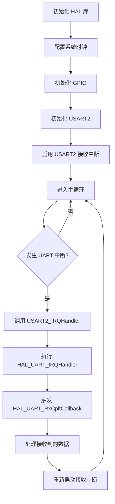

# FreeRTOS的UART通信实现
- [x] 所有实现均位于user_usart.c/.h中，不需要在其他文件中进行配置
- [x] 使用轮询对usart2的串口重定向, 怎么处理microLib
- [x] 串口中断接收，并返回相同的内容给发送方
- [ ] 串口DMA接收方式
- [ ] 串口的DMA发送方式 
- [ ] IDLE方式的接收
- [ ] Robomaster TypeA自带的IMU

## UART接收流程

串口中断接收，要先在初始化里启用一次接收中断函数，以触发第一次中断

